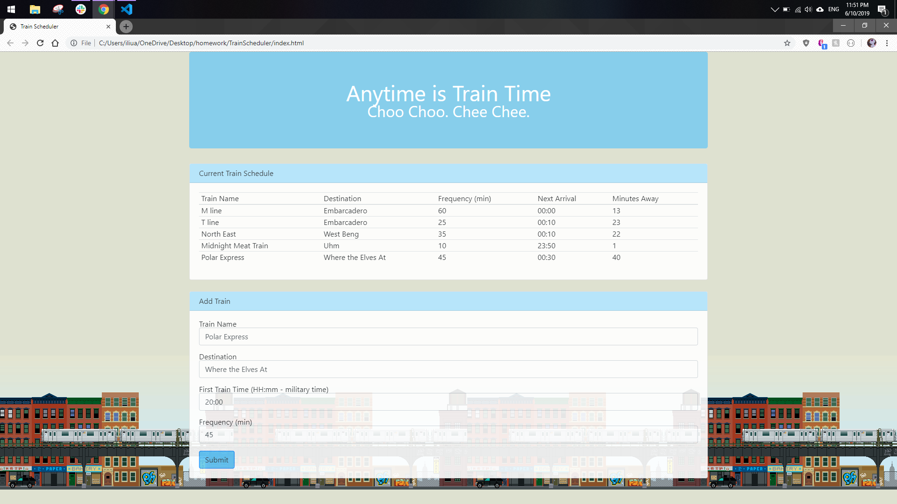

# TrainScheduler

## About
This is a page where users can check the time their train arrives. They can view some pre-existing train entries and check the time that it will arrive based off of their own current time. In addition, users will be able to add their own train to the table, which will also update to show the time that the next train will arrive as well as the minutes until arrival. The data that users input will be stored in Google's Firebase database that is linked to the page. 

## Technology Used
* HTML
* Javascript
* jQuery
* Moment.js 
* Bootstrap
* CSS 
* Firebase 

## Author 
Adrienne Liu